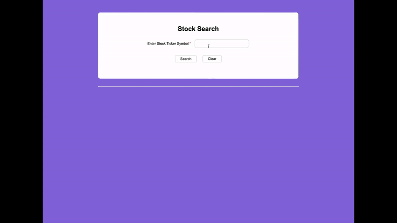

# StockSearch 📈

## Overview 📌

StockSearch is a Python Flask web application that allows users to search for stock data in real-time, view historical search records, and cache API responses for faster results. Designed with a clean separation of frontend and backend, it leverages **Flask**, **SQLite**, and the **Tiingo API** to provide an intuitive stock lookup experience.

## Features 🚀

- 🔹 **Real-time Stock Data** – Fetch daily and intraday stock data using Tiingo API.
- 🔹 **Search History** – Keep track of the last 10 searches.
- 🔹 **Caching System** – Stores stock data for 15 minutes to reduce API calls.
- 🔹 **Frontend/Backend Separation** – Flexible project structure with dedicated folders.
- 🔹 **Responsive & Lightweight** – HTML/CSS frontend served by Flask.

## Tech Stack 🛠️

- **Frontend:** HTML, CSS, JavaScript
- **Backend:** Python, Flask, SQLite, Requests
- **API:** Tiingo API for stock data

## Contributing 🤝

Contributions are welcome! To contribute:

1. Fork the repository
2. Create a new branch (`git checkout -b feature/YourFeature`)
3. Make your changes and commit (`git commit -m "Add feature"`)
4. Push to your branch (`git push origin feature/YourFeature`)
5. Open a Pull Request

Please follow clean code practices and include descriptive commit messages.

## License ⚖️

This project is released under the **MIT License**. See the full license [here](LICENSE).
